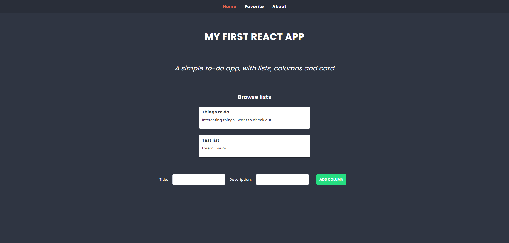
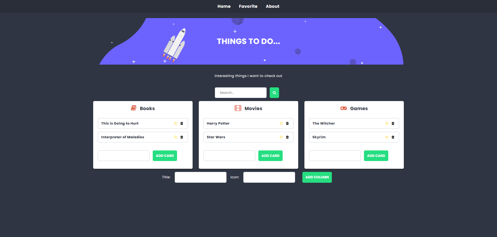

# English

## TaskBoard – React To-Do App

TaskBoard is a simple to-do application built with React.  
The app allows users to create lists (columns) and manage cards inside them, similar to a lightweight task management board.

The main goal of this project was to practice React fundamentals, routing, state management, and dynamic UI updates.

### Main features

- Create and browse task lists (columns)
- Add and remove cards inside lists
- Mark cards as favorites
- Search functionality
- Multiple views (Home, Favorite, About)
- Dynamic rendering without page reload
- Responsive layout

### Built with

- React 18
- JavaScript (ES6+)
- SCSS / CSS
- React Router/ React Redux

### Project purpose

This project was created to practice:

- Component-based architecture
- State management
- Props and event handling
- Conditional rendering
- Working with lists and dynamic data
- Basic routing in React

### Requirements

- Node.js (tested on v24.12.0, Windows)
- Git (tested on v2.52.0, Windows)
- npm or yarn

### How to run the project

```bash
npm install
npm start

npm test
npm run build
npm run eject
```

### Media 

**Home**


**List Page**
